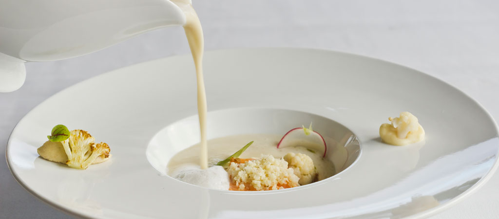
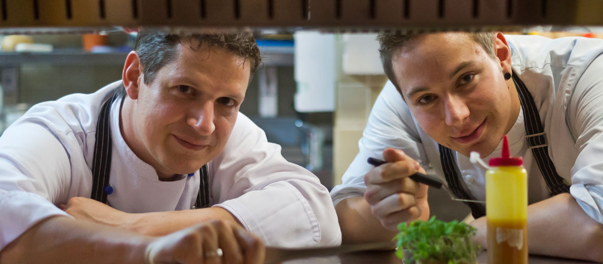
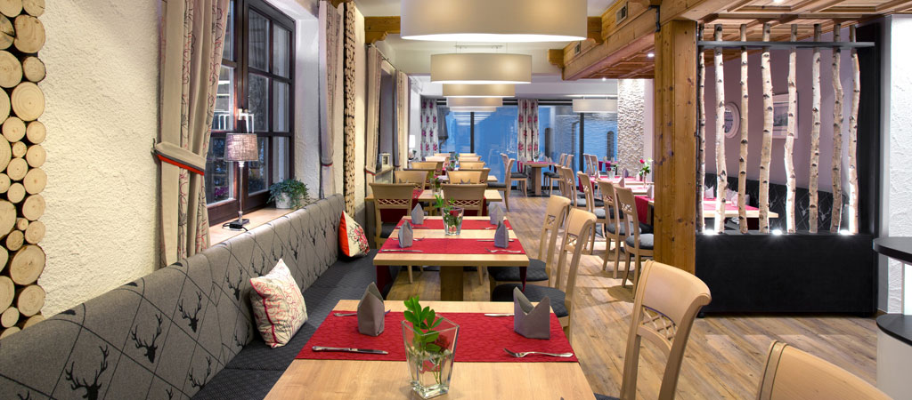
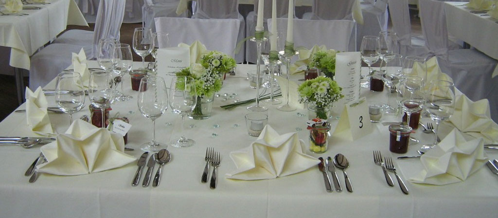

# VOGTHOF LANDGASTHOF

## Contact Information
Telefon : 07361-73688 Öffnungszeiten : Montag-Donnerstag : 11:30-14 Uhr Montag-Mittwoch : 18:00-22 Uhr Freitag : Ruhetag Samstag : 18:00-22 Uhr Sonntag : 11:30-14 Uhr Sonn- und Feiertage Abends geschlossen! Änderungen vorbehalten >Speisekarte >Tagesessen

## Kulinarisches 
## Culinary
 

Der Landgasthof Vogthof wurde 1983 von Hans und Theresia Ilg eröffnet und wird seit 2012 von ihrem Sohn Reiner und dessen Frau Bernadette weitergeführt. 

Getreu dem Motto „Der Gast ist König“ verwöhnt Familie Ilg und ihr Team Sie mit erstklassigen Speisen und edlen Tropfen.

 

 

The Landgasthof Vogthof was opened in 1983 by Hans and Theresia Ilg and has been run by their son Reiner and his wife Bernadette since 2012.

True to the motto “The guest is king”, the Ilg family and their team will spoil you with first-class dishes and fine wines.

## Images

