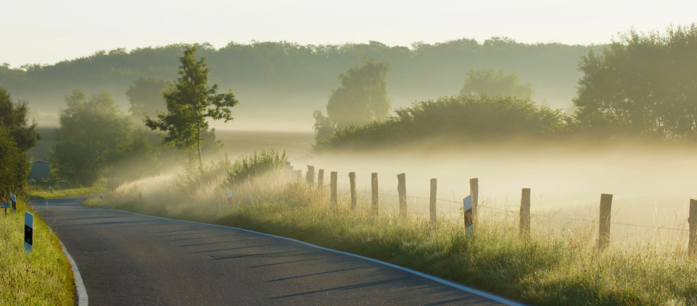
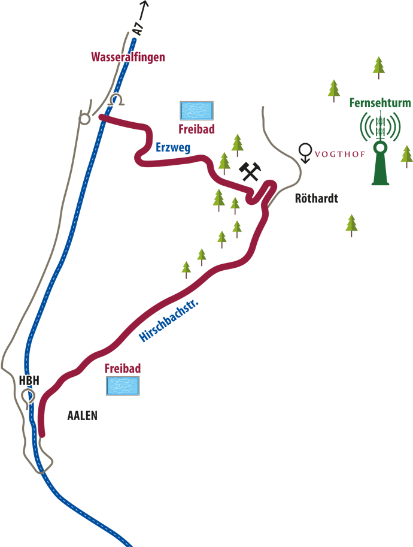

# VOGTHOF LANDGASTHOF

## Contact Information
Telefon : 07361-73688 Öffnungszeiten : Montag-Donnerstag : 11:30-14 Uhr Montag-Mittwoch : 18:00-22 Uhr Freitag : Ruhetag Samstag : 18:00-22 Uhr Sonntag : 11:30-14 Uhr Sonn- und Feiertage Abends geschlossen! Änderungen vorbehalten >Speisekarte >Tagesessen

## Anfahrt
A7 Westhausen abfahren.

Die L1029 in Richtung Aalen/Wasseralfingen folgen. In Höhe Oberalfingen an der Ampel links Richtung Oberalfingen abbiegen und der Strasse weiter in Richtung Wasseralfingen folgen.

In Wasseralfingen im Kreisverkehr Zweite Ausfahrt. Nach dem Tunnel im Kreisverkehr 3. Ausfahrt in Richtung Spieselstrasse. Dem Erzweg in Richtung Besucher Bergwerg folgen. Den Weg weiter in Richtung Röthardt. Durch den Ort nach der Kurve die 2. Einfahrt einbiegen.

Ziel Landgasthof Vogthof erreicht.

 

Directions

From the motorway A7 take the exit "Westhausen".

Follow the L1029 in the direction of "Aalen / Wasseralfingen". At the traffic lights near "Oberalfingen" turn left towards "Oberalfingen" and continue on the road towards "Wasseralfingen".

Take the second exit in the roundabout in "Wasseralfingen". After the tunnel at the roundabout take the 3rd exit towards "Spieselstrasse". Follow the street "Erzweg" towards "Besucherbergwerk".

Follow the road towards "Röthardt". In the village of "Röthardt" take the second  entrance after the curve.

You have reached your destination "Landgasthof Vogthof".

## Images

 

 

Directions
