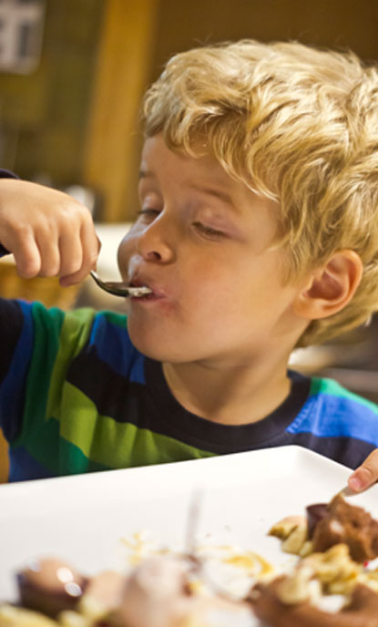

# Essen / Eat

> "Es gib kein schöneres Gefühl als den Hunger, kurz bevor man zur Speisekarte greift."
> — Sir Peter Ustinov

Bei der Auswahl unserer Gerichte legen die Küchenchefs Reiner Ilg und Johannes Hänle großen Wert auf frische und saisonale Zutaten.

Die Bandbreite unserer Produkte ist sehr abwechslungsreich. Auf unserer Speisekarte haben schwäbische Klassiker ebenso ihren Platz wie außergewöhnliche Kreationen für besondere Geschmackserlebnisse.

Beim Arrangement der Produkte achten Sie auf das kleinste Detail und richten die Speisen liebevoll an – Das Auge isst ja bekanntlich mit.

## Tagesessen

Von Montag bis Donnerstag bieten wir Ihnen zur Mittagszeit von 12:00 bis 14:00 Uhr eine Auswahl an 3 Tagesessen, bestehend aus einem Salat, einem Hauptgericht und wahlweise einer Suppe oder einem Dessert.

[Zur Tageskarte](https://www.aalen-vogthof.de/page/Tagesessen/en)

---

## English

> "There is no better feeling than hunger just before you reach for the menu."
> — Sir Peter Ustinov

When selecting our dishes, chefs Reiner Ilg and Johannes Hänle attach great importance to fresh and seasonal ingredients.

The range of our products is very varied. Our menu includes Swabian classics as well as extraordinary creations for special taste experiences.

When arranging the products, pay attention to the smallest detail and prepare the food lovingly - as we all know, the eye eats too.

## Daily meal

From Monday to Thursday we offer you a selection of 3 meals of the day at lunchtime from 12:00 to 2:00 p.m., consisting of a salad, a main course and either a soup or a dessert.

[Link to the daily menu](https://www.aalen-vogthof.de/page/Tagesessen/en)

---

## Image

